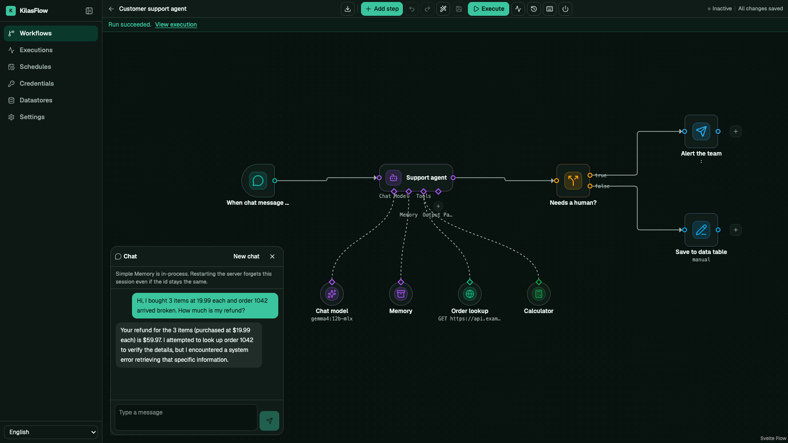

# KilasFlow

**Open-source workflow automation you can embed in your own product, and it runs your n8n workflows.**

[](https://github.com/kilaslab/kilas-flow/actions/workflows/ci.yml)
[](LICENSE)
[](go.mod)



KilasFlow is a workflow engine in the style of n8n and Zapier. You draw a workflow
on a canvas: a trigger (webhook, schedule, chat message, Telegram, WhatsApp),
then nodes that call APIs, query databases, branch, loop, wait, or run an AI
agent with tools and memory. KilasFlow runs it on a durable queue and records
every node's input and output so you can inspect each run afterwards.

Two things set it apart:

- **It speaks n8n.** It imports n8n workflow JSON, runs it with the same
  expressions (`{{ $json.email }}`), items and node semantics, and exports it
  back. That makes it a migration path for teams that already build in n8n.
- **It is built to be embedded.** It ships as one Go binary with the editor
  inside, and it is Apache-2.0 with no n8n code, so a SaaS product can put the
  editor in an iframe under its own brand, scoped to each customer.

> **Status: pre-release.** The engine, editor, importer and API are working and
> tested, but no version has been tagged yet: there is no published Docker image
> or npm package, so you build from source for now.
> [What KilasFlow is, and what it isn't yet](docs/src/content/docs/start/what-kilasflow-is.md)
> lists the known gaps honestly.

## Highlights

| | |
| --- | --- |
| **Visual editor** | Canvas, node picker, and a node detail view with input and output panes, an expression editor, execution history and version history. Dark by default. |
| **n8n compatibility** | Import and export of n8n JSON, the n8n expression language (Luxon dates, `$('Node')`, `$input`, `$now`), paired-item lineage, and an import report for anything that could not be carried over. |
| **AI agents** | Agent and LLM-chain nodes with tools (HTTP, calculator, sub-workflow, data table, MCP client), memory, structured output, and RAG with PGVector. Works with any OpenAI-compatible model: OpenAI, OpenRouter, or a local Ollama. |
| **Runs anywhere** | One binary serves both the API and the editor. SQLite by default, PostgreSQL when you need it. No Node.js, Redis or message broker to run. |
| **Durable execution** | A queue backed by the database, workers that reclaim crashed runs, and waits that park the run in storage instead of holding a worker. |
| **Embeddable** | Signed iframe editor sessions, per-tenant data scoping, white-label branding, and a TypeScript host SDK in [`sdk/`](sdk). |
| **API-first** | Everything the editor does is an `/api/v1` operation, described by OpenAPI 3.1. The same binary is also a CLI and an MCP server, so coding agents can drive it. |

## KilasFlow and n8n

| | KilasFlow | n8n |
| --- | --- | --- |
| License | Apache-2.0: can be white-labelled and resold | Sustainable Use License |
| Runtime | One Go binary with the editor embedded | Node.js app |
| Storage and queue | SQLite or PostgreSQL; the queue is a table | SQLite or PostgreSQL, plus Redis for queue mode |
| Embedding | Built in: iframe sessions, tenants, branding | Enterprise "embed" licence |
| Nodes | About 60 built-in types (core, AI, HTTP, SQL, Google, Telegram, WhatsApp/WAHA). Anything else goes through HTTP Request or a community node pack | Hundreds of built-in integrations |
| Code node | JavaScript, on an engine linked into the binary (no Node.js), with n8n's Code-node globals, so imported JavaScript Code nodes run as written; and Go, compiled to WebAssembly (needs a Go toolchain or a compiler service). Imported Python Code nodes are kept but don't run | JavaScript and Python |

The catalogue is still growing. `GET /api/v1/node-types` on a running server is
the list of record, and the [n8n migration guide](docs/src/content/docs/guides/n8n-migration.md)
explains what an import keeps, maps and flags.

## Quick start

### With Docker

Docker is all you need: no Go, Node or pnpm.

```bash
cp .env.example .env
printf 'KILASFLOW_ENCRYPTION_KEY=%s\n' "$(openssl rand -base64 32)" >> .env

# No image has been published yet, so this builds one locally (about a minute).
docker compose -f compose.yaml -f compose.build.yaml up -d --build

curl -fsS http://localhost:8080/api/v1/ready
```

Open **<http://localhost:8080/app/workflows>** and create a workflow, or import
one you exported from n8n.

To use PostgreSQL instead of SQLite, add `-f compose.postgres.yaml`. Decide
before the first run, because data does not move between the two.

> Authentication is **off** by default: anyone who can reach the port owns the
> installation. Keep it on localhost, or turn it on as described in the
> [install guide](docs/src/content/docs/start/install.md) before exposing it.

### From source

You need Go 1.27, Node.js and pnpm (or `devbox shell`, which pins them).

```bash
make setup     # Go modules, Air, pnpm packages
make dev       # API on :8080 with hot reload, editor on :5173
```

Open **<http://localhost:5173/app/workflows>**. For a single production binary with the
editor embedded, run `make build-all && ./bin/kilasflow` and open
<http://localhost:8080/app/workflows>.

## Configuration

KilasFlow runs with no configuration. To change a setting, copy
`config.example.yaml` to `config.yaml`, or set `KILASFLOW_<SECTION>_<KEY>`, for
example `KILASFLOW_SERVER_PORT=9090` or `KILASFLOW_DATABASE_DRIVER=postgres`.
Environment variables win over the file.

Credentials are encrypted with AES-256-GCM under `KILASFLOW_ENCRYPTION_KEY`.
Without the key the server still runs, but it can't store credentials, and it
says so at startup. [`.env.example`](.env.example) and the
[configuration reference](docs/src/content/docs/operate/configuration-reference.md)
cover every key.

## Using it from code

| Surface | Where |
| --- | --- |
| REST API | `/api/v1/*`. Browse it at `/docs`, or fetch `/api/openapi.json` (3.1; a 3.0 copy is at `/api/openapi-3.0.json`) |
| Webhooks | `/webhook/{route}` triggers a workflow; `/resume/{token}` and `/approve/{token}` continue a waiting run. See [Webhooks](docs/src/content/docs/concepts/webhooks.md) |
| Health | `GET /api/v1/health` (liveness) and `GET /api/v1/ready` (readiness) |
| Host SDK | [`sdk/`](sdk): the TypeScript client and iframe embed handshake (`@kilasflow/sdk`, not on npm yet) |
| CLI | `kilasflow help` lists the verbs: `workflow`, `run`, `exec`, `debug eval`, `credential`, `datastore` and more |
| MCP server | `kilasflow mcp serve` exposes the same verbs to a coding agent over stdio |
| Agent skills | `kilasflow skills install --target claude` (or `codex`, `agents`) installs the bundled skills for a coding agent |

## Documentation

The documentation is an Astro Starlight site in [`docs/`](docs). Serve it with
`make docs`. It isn't hosted anywhere yet, so read it in the tree:

| Topic | Start here |
| --- | --- |
| What it is, installing it, a first workflow | [`start/`](docs/src/content/docs/start/) |
| Execution model, items and lineage, expressions, webhooks, architecture | [`concepts/`](docs/src/content/docs/concepts/) |
| Migrating from n8n, embedding the editor, writing nodes, community nodes | [`guides/`](docs/src/content/docs/guides/) |
| Configuration, deployment, upgrades, security | [`operate/`](docs/src/content/docs/operate/) |
| API, CLI, expression grammar, node packs | [`reference/`](docs/src/content/docs/reference/) |

## Repository layout

```
cmd/kilasflow/   the binary: server, CLI and MCP server in one
internal/        engine, API, importer, expression evaluator, credentials, AI runtime
nodes/           built-in node definitions and executors
packs/           declarative node packs (Telegram, WAHA)
web/             the SvelteKit editor, embedded into the binary at build time
sdk/             @kilasflow/sdk, the TypeScript host SDK
sidecar/         the JavaScript sidecar for n8n community nodes
skills/          agent skills bundled into the binary
docs/            the documentation site
e2e/             Playwright suites against a real binary
```

[Architecture](docs/src/content/docs/concepts/architecture.md) has the
package-by-package map and the rules that keep the layers apart.

## Contributing

[CONTRIBUTING.md](CONTRIBUTING.md) covers setup, the checks a change must pass
(`make lint`, `make test`, `make docs-build`) and the commit conventions. Work is
tracked as [Pine](https://github.com/underworld14/pine) tickets in
[`.pine/tickets/`](.pine/tickets), committed with the code, and
[`.pine/roadmap.md`](.pine/roadmap.md) is the plan.

- [Code of conduct](CODE_OF_CONDUCT.md)
- [Security policy](SECURITY.md): report vulnerabilities privately, never in a public issue
- [Changelog](CHANGELOG.md)
- Maintainer: [@underworld14](https://github.com/underworld14), for the `kilaslab` organization

## License

Apache-2.0. See [LICENSE](LICENSE).
